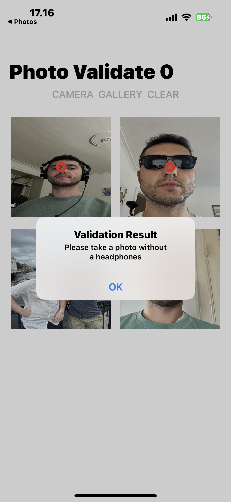
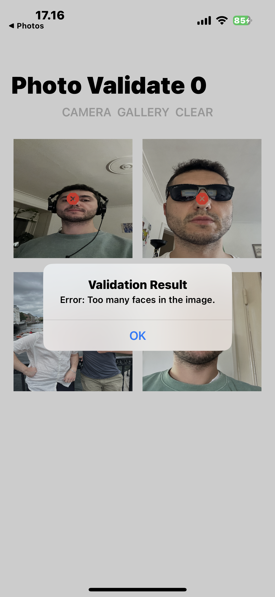

# head-body-analysis
The app focuses on using the Vision framework to analyze human images.   
https://developer.apple.com/documentation/vision/  

The framework offers a quite range of possibilities, in this project, I have examined the following:  
- The number of faces visible in the image.  
- The accessories detected around the head.  
- Quality of the face capture  
- Visible body parts in the image.  

  
  
  
  

